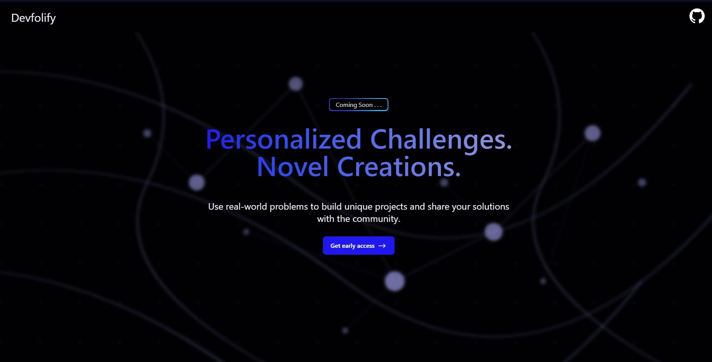

# 
    Devfolify 👀

## Overview

Devfolify is a full stack application designed to facilitate project creation among its community. I want to help support others with envisioning and creating new innovative projects for the benefit of society and the open source community. This approach not only helps you develop new projects, experience, knowledge, and skills but also fosters real-world problem-solving abilities, and perhaps even that idea of a lifetime that could take you to great places!

The vision is to create a platform akin to LeetCode, but instead of focusing on algorithm and data structure challenges, it will center on solving real-world problems across various industries. The platform will include a community-driven aspect, allowing users to share solutions and projects addressing these problems, with features for voting on and showcasing the best contributions.

Now the main premise and idea behind this app, although not fully built yet, is that people will be able to make a curated list of problems in any given industry and subject they might choose. From this, they can solve it with a project or program they make. Then they can share their solution with the community! Somewhat like a mini hackathon but on everyones own time and with a public leaderboard, individual stats, a place to discover other peoples projects, and a global monthly challenge... But not only that, it encourages people to instead of just building a premade project, find their own solution to a real world issue with creativity and code. 

## Project Website 🌐

Join the waitlist and become a potential beta tester at [devfolify.com](https://devfolify.com)

## Contributing 🤝

Currently I want to setup a working MVP before making contributions to this project public. Also the repository is pretty messy right now.

## License 📜

This project is licensed under the MIT License. See the [LICENSE](LICENSE) file for details.

---

Thank you for checking out Devfolify! Please join the waitlist available [here](https://devfolify.com/#waitlist) and give this repo a star to stay updated ‼️
